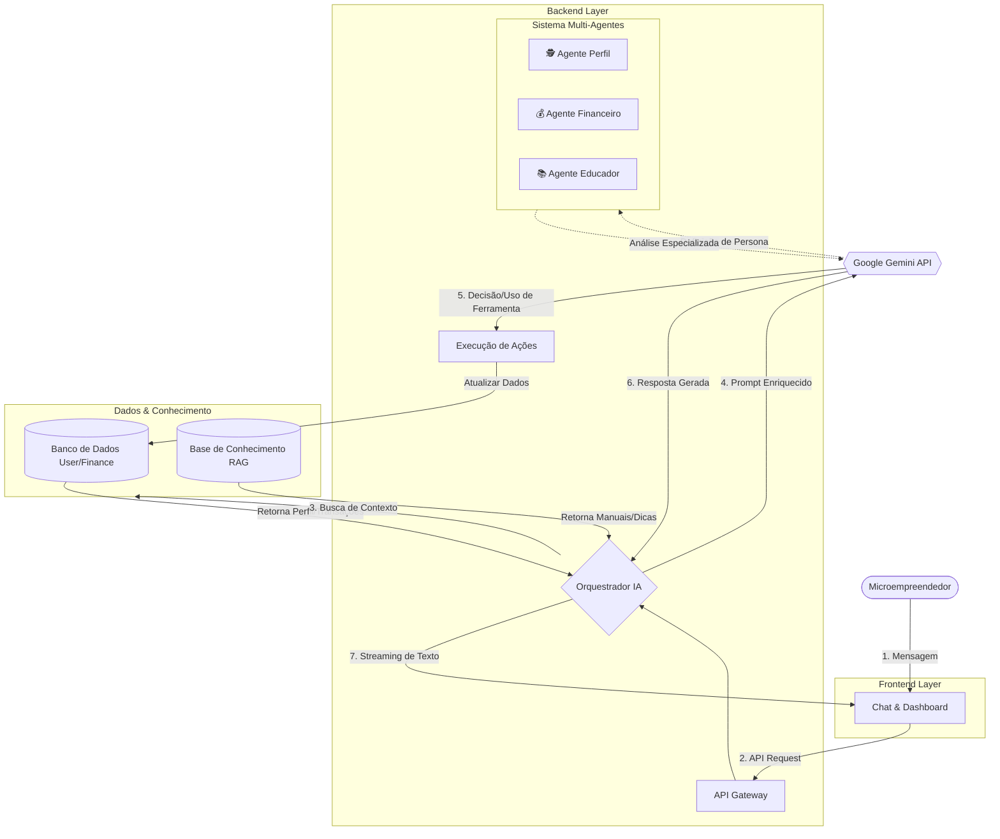

# Arquitetura Técnica do Meu MEI

Este documento detalha a arquitetura completa do ecossistema Meu MEI, destacando o fluxo de dados, a orquestração de Inteligência Artificial usando o conceito de **Multi-Agentes** e a aplicação de **RAG (Retrieval-Augmented Generation)** para personalização extrema.

## 1. Visão Geral da Arquitetura

O sistema opera em uma arquitetura moderna baseada em microsserviços lógicos, onde o **Frontend (Next.js)** atua como a interface do cliente e o **Backend (FastAPI)** atua como o orquestrador central de inteligência e dados.

### Diagrama de Alto Nível (Visualização)


### Diagrama de Alto Nível (Código Mermaid)



### Diagrama em Texto (ASCII)

Caso o diagrama acima não renderize, veja a estrutura lógica:

[ Microempreendedor ]
        |
        | (Interage)
        v
[ Frontend (Next.js) ] <---> [ Backend (FastAPI) ]
                                    |
            +-----------------------+-----------------------+
            |                       |                       |
    [ Auth/Segurança ]      [ Orquestrador de IA ]          |
                                    |                       |
                                    v                       v
                           [ Google Gemini API ]    [ Banco de Dados ]
                                    |               (Supabase/Postgres)
           +------------------------+-----------------------+
           |                        |                       |
[ Agente Perfil ]           [ Agente Financeiro ]   [ Agente Educador ]
(Analisa Comportamento)     (Analisa Números)       (Traduz/Ensina)
           |                        |                       |
           v                        v                       v
[ Base de Conhecimento ]       [ Ações/Tools ]      [ Dashboards ]
(RAG - Manuais/Dicas)          (Salvar/Atualizar)

```

---

## 2. Detalhamento dos Componentes

### A. Camada de Orquestração de IA (O "Cérebro")
O coração do sistema não é apenas um chatbot, mas um **Orquestrador**. Quando uma mensagem chega:

1.  **Context Builder (RAG - Nível 1):** O sistema varre o banco de dados em tempo real para montar o "Estado Atual" do usuário.
    *   *Quem é?* (João, Pintor, Nível 2 de Maturidade).
    *   *Qual o sonho?* (Comprar uma van nova).
    *   *Situação Financeira?* (Saldo: R$ 500, Meta: R$ 5.000, Atrasado na meta).
    *   Isso é injetado no prompt do modelo antes mesmo dele "pensar".

2.  **RAG Semântico (Nível 2 - Base de Conhecimento):** Se a pergunta for técnica (ex: "Como emito nota fiscal?"), o sistema busca na **Base de Conhecimento** (Manuais do Sebrae/Gov) os trechos relevantes e entrega ao modelo para que ele responda com precisão, evitando alucinações.

### B. Sistema Multi-Agentes (Especialistas)
Embora usemos um modelo LLM poderoso (Gemini), ele é instruído via *System Prompts* complexos a atuar com diferentes "chapéus" (Personas/Agentes) dependendo da necessidade:

1.  **🕵️ Agente de Perfil (Profile Agent):**
    *   **Função:** Monitora o comportamento do usuário.
    *   **Ação:** Se o usuário começa a registrar muitas vendas mas não registra saídas, ele alerta: *"João, vi que entrou muito dinheiro, mas você não teve custos com tinta esse mês? Isso pode distorcer seu lucro real."*
    *   **Objetivo:** Evoluir o Nível de Maturidade (IAMF-MEI) do cliente.

2.  **💰 Agente Financeiro (CFO Virtual):**
    *   **Função:** Analisa números frios.
    *   **Raciocínio:** *"Você recebeu R$ 2.000,00. Baseado no seu histórico, você costuma gastar R$ 1.500,00 em fornecedores dia 20. Sugiro guardar esse dinheiro."*

3.  **📚 Agente Educador (Mentor):**
    *   **Função:** Traduz o "financês" para a linguagem do sonho do usuário.
    *   **Ação:** Em vez de dizer *"Seu fluxo de caixa está negativo"*, ele diz *"João, para comprarmos sua van (seu sonho) até dezembro, precisamos economizar um pouco mais nas compras de material semanais."*

### C. Tool Use & Execução (Agente de Ação)
O modelo não apenas fala, ele **age**. Através do `ToolManager`, a IA pode executar funções no backend:
*   `save_transaction()`: A IA detecta a intenção *"Gastei 50 reais em almoço"* e executa a gravação no banco automaticamente.
*   `update_goal()`: *"Mude minha meta para 10 mil"* -> A IA altera a configuração do perfil.
*   `generate_chart()`: A IA pode solicitar a geração de dados para gráficos no frontend.

### D. Gestão de Memória e Continuidade
Para garantir que a conversa seja fluida e a IA não "esqueça" detalhes importantes, utilizamos uma estratégia híbrida:

1.  **Janela Deslizante (Short-term Memory):** As últimas 10-15 mensagens são mantidas no contexto imediato (raw text) para permitir referências rápidas ("O que eu disse antes?").
2.  **Sumarização de Sessão (Long-term Memory):**
    *   Quando uma conversa se encerra ou atinge um limite de tokens, um *background job* processa o texto.
    *   A IA extrai **Fatos Relevantes** (ex: "Usuário comprou tinta vermelha", "Usuário reclamou de taxa alta") e os salva na tabela de Perfil/Notas.
    *   Nas próximas sessões, esses resumos são re-injetados via RAG, permitindo que a IA lembre de fatos ocorridos semanas atrás sem precisar reler todo o histórico.

---

## 3. Tecnologias Envolvidas

*   **LLM:** Google Gemini 2.0 Flash (Alta velocidade, baixo custo, janela de contexto longa para RAG).
*   **Vector Database:** Supabase pgvector (para busca semântica na base de conhecimento).
*   **Backend:** Python/FastAPI (Async para lidar com streaming de múltiplos agentes).
*   **Protocolo:** Server-Sent Events (SSE) para resposta fluida no chat enquanto os "agentes" trabalham nos bastidores.
